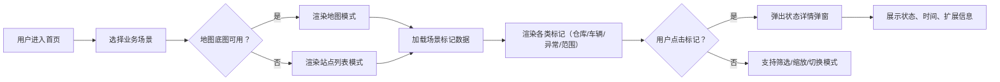

## 1. 产品概述

物流地图标注组件是一个可复用的前端组件，用于在物流管理系统中可视化展示各类物流节点（仓库、车辆、异常包裹、配送范围）。组件支持地图底图模式与站点列表模式的自动切换，并通过三个示例场景（快递、冷链、同城配送）展示组件的灵活应用。

- 解决问题：物流运营人员需要快速识别网络中的关键节点状态、定位异常、掌握配送覆盖范围
- 目标用户：物流运营人员、调度人员、客服人员、管理层
- 市场价值：提升物流可视化水平，加速决策响应，降低异常处理成本

## 2. 核心功能

### 2.1 功能模块

1. **地图标注组件（LogisticsMap）**：核心容器组件，管理标记渲染、模式切换、事件分发
2. **标记类型系统**：仓库（Warehouse）、车辆（Vehicle）、异常包裹（ExceptionPackage）、配送范围（DeliveryZone）
3. **状态弹窗（MarkerPopup）**：点击标记后展示详细状态信息与时间戳
4. **站点列表模式（StationList）**：无地图底图时的降级视图，保持功能完整性
5. **场景示例页**：快递网络、冷链物流、同城配送三种典型业务场景

### 2.2 页面详情

| 页面名称 | 模块名称 | 功能描述 |
|---------|---------|---------|
| 首页 / 场景导航 | 场景卡片 | 三个业务场景入口卡片，含场景描述与预览图 |
| 快递场景页 | 地图标注 + 图例 + 筛选器 | 展示全国快递分拨中心、干线车辆、异常件、服务范围 |
| 冷链场景页 | 地图标注 + 温度监控 + 图例 | 展示冷库、冷藏车、温控异常、冷链覆盖区 |
| 同城配送页 | 地图标注 + 实时调度 + 图例 | 展示前置仓、骑手位置、超时订单、30分钟配送圈 |

## 3. 核心流程

## 4. 用户界面设计

### 4.1 设计风格

- **主色调**：深海蓝 `#0F2A4A`（专业、可信赖）+ 信号橙 `#FF6B35`（警示、活跃）
- **辅助色**：成功绿 `#10B981`、警告黄 `#F59E0B`、危险红 `#EF4444`、信息青 `#06B6D4`
- **背景**：深空渐变 `#0A1628 → #1E3A5F`（地图模式）、冷灰白 `#F1F5F9`（列表模式）
- **字体**：标题用 `Space Grotesk`（几何无衬线，科技感），正文用 `Noto Sans SC`（中文友好）
- **标记样式**：自定义 SVG 图标 + 脉冲光晕（活跃节点）+ 振动动画（异常节点）
- **弹窗样式**：磨砂玻璃效果（backdrop-filter），8px 圆角，细边框高光
- **按钮风格**：胶囊形，hover 时有发光效果，激活态有内阴影
- **图标风格**：线性 SVG，2px 描边，状态色填充

### 4.2 页面设计概览

| 页面名称 | 模块名称 | UI 元素 |
|---------|---------|---------|
| 场景导航页 | Hero 区 + 场景卡片 | 渐变标题、动态粒子背景、三张悬浮卡片（带毛玻璃）、入场动画 |
| 快递场景页 | 顶部栏 + 地图区 + 侧栏 | 场景标题、筛选标签页、SVG 手绘地图底图、浮动图例、侧栏统计面板 |
| 冷链场景页 | 顶部栏 + 地图区 + 温度条 | 温度色阶条、冷雾粒子效果、冷库呼吸动画、异常件红光闪烁 |
| 同城配送页 | 顶部栏 + 地图区 + 调度面板 | 配送圈环形动画、骑手移动轨迹、超时倒计时、订单流水 |

### 4.3 响应式设计

- **Desktop（≥1280px）**：地图区 + 侧栏双栏布局，弹窗自由浮动
- **Tablet（768-1279px）**：侧栏折叠为抽屉，标记尺寸自适应缩放
- **Mobile（<768px）**：默认列表模式，地图模式可手动切换，弹窗改为底部滑出面板
- **触屏优化**：标记点击热区 ≥44px，支持双指缩放，禁用悬停提示改用点击

### 4.4 动效设计指引

- 标记入场：延迟错位淡入 + 向上漂浮（stagger 50ms）
- 异常标记：红色光晕脉冲（2s 周期）+ 轻微旋转抖动
- 配送范围：环形波纹扩散动画（3s 循环）
- 弹窗出现：背景模糊渐入 + 弹窗从标记点弹出缩放
- 模式切换：交叉溶解过渡（400ms ease-out）
- 场景切换：页面水平滑动 + 数据渐进加载
