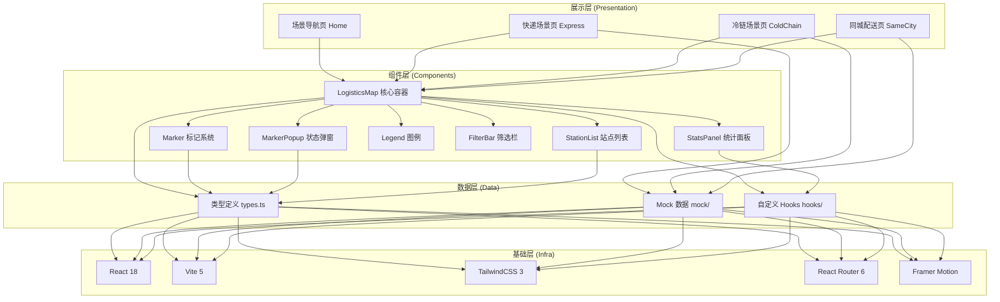

## 1. 架构设计



## 2. 技术选型说明

| 技术 | 版本 | 选型理由 |
|-----|------|---------|
| React | 18.x | 组件化开发，Hooks 便于状态管理与逻辑复用 |
| Vite | 5.x | 极速开发体验，HMR 秒级生效，生产构建优化 |
| TailwindCSS | 3.4.x | 原子化 CSS，快速落地设计系统，响应式开箱即用 |
| React Router | 6.x | 声明式路由，场景页切换无需额外配置 |
| Framer Motion | 11.x | 流畅动画系统，弹窗/过渡/脉冲动效一行代码搞定 |
| Lucide React | 0.400.x | 高质量线性 SVG 图标库，支持自定义描边颜色 |

**初始化方式**：`npm create vite@latest . -- --template react-ts`

**后端/数据库**：无。使用本地 Mock 数据（TS 对象字面量）模拟各场景数据。

## 3. 路由定义

| 路由路径 | 页面组件 | 说明 |
|---------|---------|------|
| `/` | `HomePage` | 场景导航页，三张卡片入口 |
| `/express` | `ExpressPage` | 快递网络场景 |
| `/cold-chain` | `ColdChainPage` | 冷链物流场景 |
| `/same-city` | `SameCityPage` | 同城配送场景 |
| `*` | `Navigate to /` | 404 重定向到首页 |

## 4. 数据模型定义

### 4.1 核心类型

```typescript
// 标记类型枚举
export type MarkerType = 'warehouse' | 'vehicle' | 'exception' | 'zone';

// 标记状态枚举
export type MarkerStatus = 'normal' | 'warning' | 'danger' | 'inactive';

// 坐标（百分比，0-100，相对地图容器）
export interface Coordinate {
  x: number;
  y: number;
}

// 基础标记接口
export interface BaseMarker {
  id: string;
  type: MarkerType;
  name: string;
  coordinate: Coordinate;
  status: MarkerStatus;
  updatedAt: string; // ISO 时间戳
  description?: string;
}

// 仓库标记
export interface WarehouseMarker extends BaseMarker {
  type: 'warehouse';
  capacity: number;      // 容量（吨/立方米/件）
  capacityUsed: number;  // 已用
  staffCount: number;    // 在岗人员
  temperature?: number;  // 温度（冷链场景）
}

// 车辆/骑手标记
export interface VehicleMarker extends BaseMarker {
  type: 'vehicle';
  driverName: string;
  vehicleNo: string;
  loadWeight: number;    // 载重
  maxWeight: number;     // 额定载重
  speed?: number;        // 速度 km/h
  eta?: string;          // 预计到达时间
  routeId?: string;
}

// 异常包裹标记
export interface ExceptionMarker extends BaseMarker {
  type: 'exception';
  trackingNo: string;
  exceptionType: 'damaged' | 'lost' | 'delayed' | 'temperature' | 'other';
  severity: 'low' | 'medium' | 'high' | 'critical';
  handler?: string;      // 处理人
  resolvedAt?: string;
}

// 配送范围标记
export interface ZoneMarker extends BaseMarker {
  type: 'zone';
  radius: number;        // 半径（像素/百分比）
  slaMinutes: number;    // SLA 时效（分钟）
  coverageCount: number; // 覆盖订单数
}

// 联合类型
export type LogisticsMarker =
  | WarehouseMarker
  | VehicleMarker
  | ExceptionMarker
  | ZoneMarker;

// 场景配置
export interface SceneConfig {
  id: string;
  name: string;
  subtitle: string;
  accentColor: string;
  backgroundGradient: string;
  mapBasePath?: string;  // SVG 底图路径（可选）
}
```

### 4.2 组件 Props 定义

```typescript
// LogisticsMap 核心组件 Props
interface LogisticsMapProps {
  markers: LogisticsMarker[];
  sceneConfig: SceneConfig;
  mode?: 'map' | 'list';       // 显示模式
  defaultMode?: 'map' | 'list';
  showLegend?: boolean;
  showFilter?: boolean;
  showStats?: boolean;
  onMarkerClick?: (marker: LogisticsMarker) => void;
  onModeChange?: (mode: 'map' | 'list') => void;
  filterTypes?: MarkerType[];  // 筛选类型
  onFilterChange?: (types: MarkerType[]) => void;
}

// MarkerPopup 弹窗 Props
interface MarkerPopupProps {
  marker: LogisticsMarker | null;
  anchorCoordinate?: Coordinate;  // 锚点位置（用于定位）
  onClose: () => void;
}
```

## 5. 目录结构

```
src/
├── components/
│   ├── LogisticsMap/
│   │   ├── index.tsx              # 核心容器
│   │   ├── Marker.tsx             # 单个标记渲染
│   │   ├── MarkerPopup.tsx        # 状态弹窗
│   │   ├── StationList.tsx        # 站点列表降级视图
│   │   ├── Legend.tsx             # 图例
│   │   └── FilterBar.tsx          # 筛选栏
│   ├── StatsPanel.tsx             # 统计面板
│   ├── SceneHeader.tsx            # 场景页顶栏
│   └── SceneCard.tsx              # 首页场景卡片
├── pages/
│   ├── HomePage.tsx               # 场景导航
│   ├── ExpressPage.tsx            # 快递
│   ├── ColdChainPage.tsx          # 冷链
│   └── SameCityPage.tsx           # 同城
├── data/
│   ├── types.ts                   # 类型定义
│   ├── scenes.ts                  # 场景配置
│   └── mock/
│       ├── express.ts             # 快递 mock
│       ├── coldChain.ts           # 冷链 mock
│       └── sameCity.ts            # 同城 mock
├── hooks/
│   ├── useLogisticsFilter.ts      # 筛选逻辑
│   └── useAdaptiveMode.ts         # 模式自适应（检测底图/屏幕）
├── styles/
│   └── globals.css                # Tailwind 入口 + 自定义动画
├── App.tsx
├── main.tsx
└── router.tsx
```

## 6. 关键实现要点

1. **相对坐标系统**：标记坐标采用百分比 (0-100) 而非绝对像素，确保在任意容器尺寸下位置正确。标记 DOM 使用 `position: absolute; left: x%; top: y%; transform: translate(-50%, -50%)` 居中定位。

2. **无地图底图检测**：`useAdaptiveMode` Hook 检测 `sceneConfig.mapBasePath` 是否存在且加载成功，若失败或移动端屏幕 <768px 则自动切换到 `list` 模式。用户可手动切换并记忆到 `sessionStorage`。

3. **异常标记动效**：使用 Tailwind `animate-pulse` 自定义变体 + Framer Motion `animate: { rotate: [-2, 2, -2] }` 循环实现红光抖动。

4. **配送范围动画**：SVG `<circle>` + Framer Motion `animate: { r: [radius, radius*1.2, radius], opacity: [0.5, 0.2, 0.5] }` 实现呼吸扩散。

5. **弹窗定位**：`MarkerPopup` 接收 `anchorCoordinate`，用 CSS `calc()` 计算位置，自动检测边界溢出（靠近右/下边缘时翻转方向）。

6. **列表模式**：`StationList` 按 `type` 分组展示，每组带折叠面板，列表项点击同地图模式触发 `onMarkerClick` 打开弹窗。
